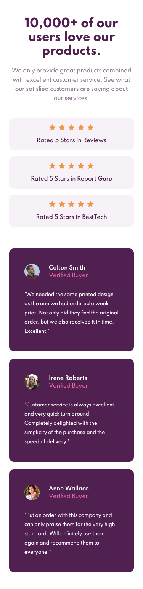

# Frontend Mentor - Social proof section solution

This is a solution to the [Social proof section challenge on Frontend Mentor](https://www.frontendmentor.io/challenges/social-proof-section-6e0qTv_bA). Frontend Mentor challenges help you improve your coding skills by building realistic projects.

## Table of contents

- [Overview](#overview)
  - [The challenge](#the-challenge)
  - [Screenshot](#screenshot)
  - [Links](#links)
- [My process](#my-process)
  - [Built with](#built-with)
  - [What I learned](#what-i-learned)
- [Author](#author)

## Overview

I decided I need to practice Tailwind and a good way to do this would be to replicate sites.

### The challenge

Users should be able to:

- View the optimal layout depending on their device's screen size

### Screenshot and link

- Live Site URL: [GitHub Pages](https://ewhite1999.github.io/social-proof-section/)

## My process

### Built with

- Tailwind CSS
- Flexbox
